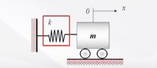
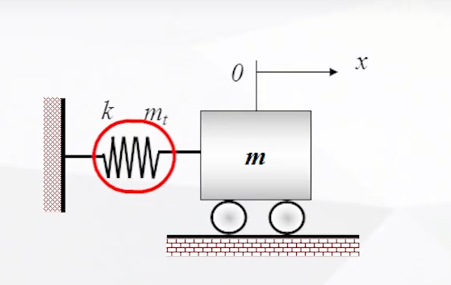
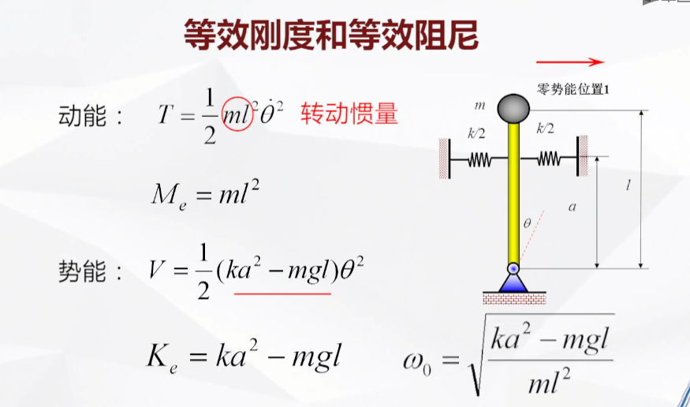
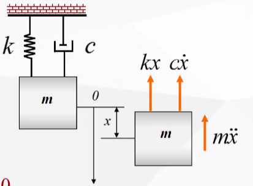
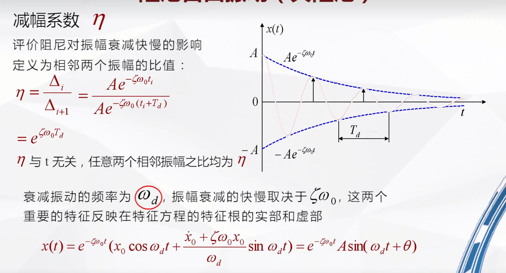
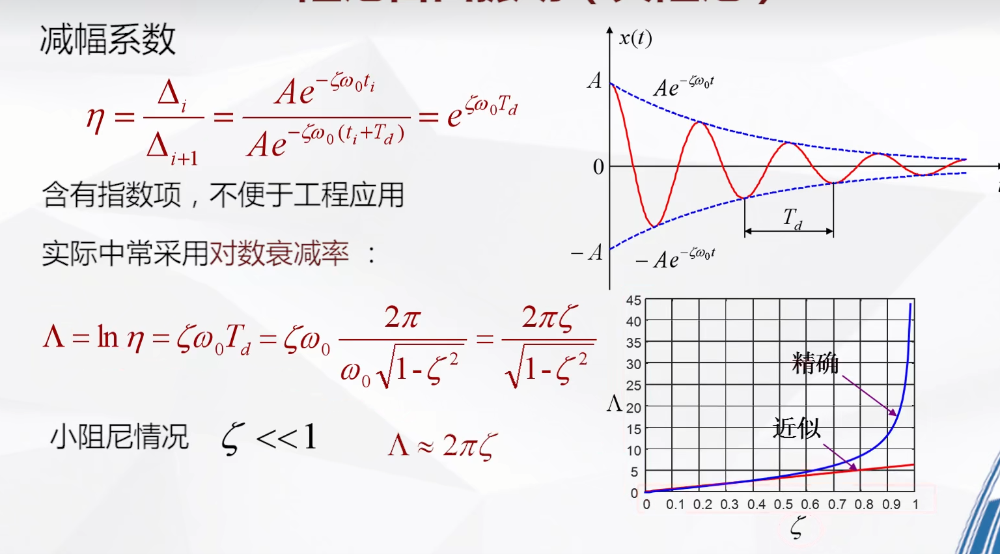
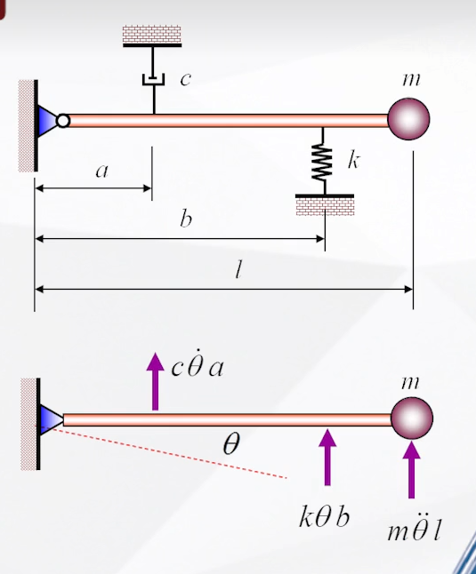

# 无阻尼单自由度振动瑞利法
&emsp;&emsp;能量法求解固有频率时，对系统的动能只考虑了惯性元件的动能，忽略了弹性元件所具有的动能，因此计算出的固有频率是实际的上限。  
&emsp;&emsp;在工程中弹性元件占系统总质量大比例的情况下不能忽略，否则计算得到的频率偏高。  

例如：弹簧质量系统  
&emsp;&emsp;设弹簧动能： $$ T=\frac{1}{2} M_e \dot{x}^2 $$  
&emsp;&emsp;系统最大动能： $$ T_{max}=\frac{1}{2}m\dot{x}^2_{max} +\frac{1}{2}m_t\dot{x}^2_{max} =\frac{1}{2}(m+m_t)\dot{x}^2_{max} $$  
&emsp;&emsp;系统最大势能：$$V_{max}=\frac{1}{2}kx^2_{max}  $$  
&emsp;&emsp;能量法 $$ T_{max} =V_{max} $$&emsp;&emsp;&emsp;&emsp;$$  dot{x}^2=\omega_0x_{max} $$  
&emsp;&emsp;推到得：$$\omega_0=\sqrt{\frac{k}{m+m_t}}    $$

# 等效刚度和等效阻尼
## 方法1：  
选定广义坐标系后，将系统的动能和势能写入下：  
$$ 
T=\frac{1}{2} M_e \dot{x}^2 
$$
$$
V=\frac{1}{2} K_e \dot{x}^2 
$$
当&emsp;$\dot{x}$、&emsp;x&emsp;分别取最大时，$T->T_{max} $&emsp;&emsp;&emsp;&emsp;$V->V_{max} $  
推到得：
$$
\omega_0=\sqrt{\frac{K_e}{M_e}}
$$
$K_e$:简化系统的等效刚度&emsp;&emsp; $M_e$:简化系统的等效质量  
 等效的含义是指简化前后系统的动能和势能相等 

 
## 方法2：  定义法  
等效刚度：使系统在选定坐标系上产生单位位移而在此坐标方向上施加的力，叫做在这个坐标上的等效刚度。  
等效刚度：使系统在选定坐标系上产生单位加速度而在此坐标方向上施加的力，叫做在这个坐标上的等效刚度。

# 单自由系统阻尼振动
1. 欠阻尼，振幅衰减振动
2. 过阻尼，按指数规律衰减的非周期蠕动
3. 临界阻尼 ，按指数规律耍贱的非周期运动，比过阻尼衰减快  
## 欠阻尼系统
&emsp;&emsp;最常用的阻尼力学模型为粘性阻尼，阻尼与速度成正比  
$$
P_d=cV
$$
&emsp;&emsp;c：为粘性阻尼系数，或者阻尼系数  
&emsp;&emsp;V：为速度  

单自由度系统阻尼振动方程：  
$$
m\ddot{x(t)}+c\dot{x(t)}+kx(t)=0
$$

设：$\frac{c}{m}=2\zeta\omega_0$  &emsp;&emsp;
有：$\omega_0=\sqrt{\frac{k}{m}}$...无阻尼系统固有频率  

方程两边同时除以m  
$$
\ddot{x(t)}+2\zeta\omega_0\dot{x(t)}+\omega_0^2x(t)=0\quad\zeta=\frac{c}{2\sqrt{km}}\quad \zeta:\text {相对阻尼系数}
$$
令：$x=e^{\lambda}$  
特征方程：
$$
\lambda^2+2\zeta\omega_0\lambda+\omega_0^2=0
$$
特征根
$$
\lambda_{1,2}=-\zeta\omega_0\pm\omega_0\sqrt{\zeta^2-1}
$$
三种情况：  
| $\lambda<1$ | $\lambda>1$ | $\lambda=1$ |
| :---: | :---: | :---: |
| 欠阻尼 | 过阻尼 | 临界阻尼 |

## 欠阻尼自动振动
### 求解过程
$$
\lambda<1
$$
&emsp;&emsp;有两个复数根
$$
\lambda_{1,2}=-\zeta\omega_0\pm\omega_d \quad\omega_d=\omega_0\sqrt{1-\zeta^2}
$$
&emsp;&emsp;振动解：
$$
x(t)=e^{-\zeta\omega_0t}(c_1\cos(\omega_dt)\pm c_2\sin(\omega_dt)) 
$$
&emsp;&emsp;$c_1$ 和$c_2$ 由初始条件决定  
&emsp;&emsp;设初始条件：$$ x(0)=x_0$$ $$\quad$$ $$\dot{x(0)}=\dot{x}_0 $$
$$
x(t)=e^{-\zeta\omega_0t}(x_o\cos{\omega_dt}\pm{\frac{\dot{x_0}+\zeta\omega_0x_0}{\omega_d}}\sin{\omega_dt})
$$
&emsp;&emsp;三角函数合并：
$$
x(t)=e^{-\zeta\omega_0t}A(\sin{\omega_dt+\theta})
$$
$$
A=\sqrt{x_o^2+(\frac{\dot{x_0}+\zeta\omega_0x_0}{\omega_d})^2}\quad \theta=\tg^{-1}(\frac{\dot{x_0}+\zeta\omega_0x_0}{\omega_d})
$$
&emsp;&emsp;A为振幅，$\theta$为相位差
### 周期分析
&emsp;&emsp;由$\omega_d=\omega_0\sqrt{1-\zeta^2}$推到周期 $T_d=\frac{2\pi}{\omega_d}=\frac{2\pi}{\omega_0\sqrt{1-\zeta^2}}=\frac{T_0}{\sqrt{1-\zeta^2}}$  
&emsp;&emsp;因此，欠阻尼自由振动的周期大于无阻尼自由振动的周期。
### 减幅分析
&emsp;&emsp;减幅系数定义：
$$
\eta=\frac{\Delta_i}{\Delta_{i+1}}=e^{\eta\omega_0T_d} 
$$

&emsp;&emsp;对数减幅衰减率：
$$
\Lambda=\ln\eta=\zeta\omega_0T_d=\frac{2\pi\zeta}{\sqrt{1-\zeta^2}}
$$
&emsp;&emsp;$\zeta<<1$，$\Lambda\approx 2\pi\zeta$,在工程中，相对阻尼系数$\zeta$很小时，计算准确性高。

## 阻尼自由振动算例
&emsp;&emsp;小球微振动，竖直方向运动，弧长近似于半径乘以弧度，根据振动的特性，惯性力为$m\ddot{\theta}(t)l$，阻尼力$c\dot{\theta}(t)a$，弹性力$k\theta(t)b$，对于支点力矩为0（杆不会绕着支点转动）：  
$$
m\ddot{\theta}(t)l \ * l +c\dot{\theta}(t)a\ *a+k\theta(t)b\ *b=0 \\
ml^2\ddot{\theta}(t)+ca^2\dot{\theta}(t)+kb^2\theta(t)=0
$$
&emsp;&emsp;惯性项系数：$ml^2$&emsp;&emsp;阻尼项系数：$ca^2$&emsp;&emsp;&emsp;&emsp;弹性项系数：$kb^2$  
&emsp;&emsp;无阻尼$\omega_0=\sqrt{\frac{kb^2}{ml^2}}$
&emsp;&emsp;相对阻尼系数$\zeta=\frac{\color{red}{c}}{2\sqrt{\color{red}{k}{\color{red}{m}}}}=\frac{{ca^2}}{2\sqrt{kb^2ml^2}}=\frac{ca^2}{2mlb}\sqrt{\frac{m}{k}}$  
&emsp;&emsp;阻尼固有频率：$\omega_d=\omega_0\sqrt{1-\zeta^2}$

# 参考文件
<iframe width="100%" height="468" src="https://www.bilibili.com/video/BV177411h7zV?spm_id_from=333.788.videopod.episodes&vd_source=b74af8d6f481026ee0d55f4ec1db8758&p=12" scrolling="no" border="0" frameborder="no" framespacing="0" allowfullscreen="true"> </iframe>