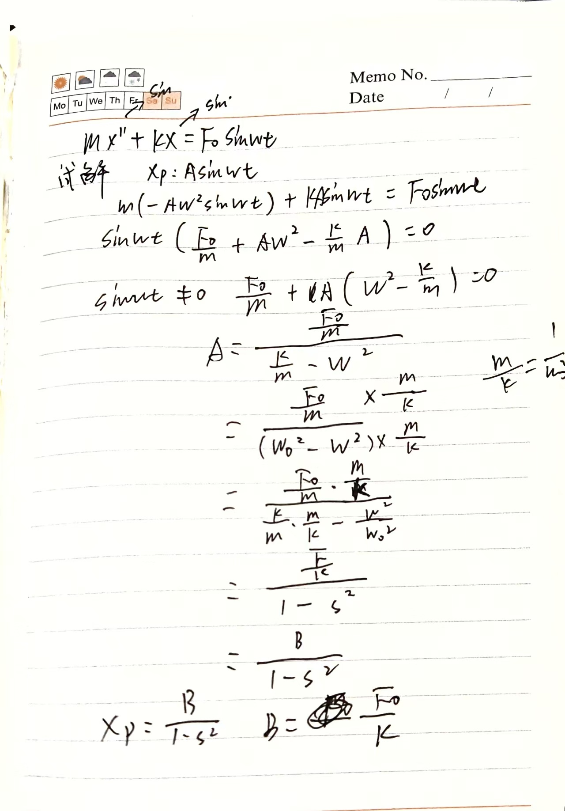
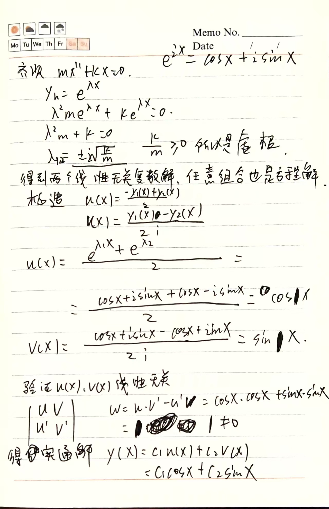
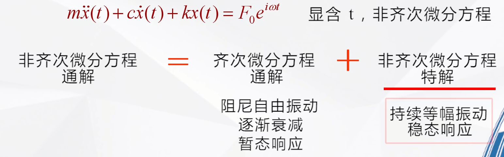
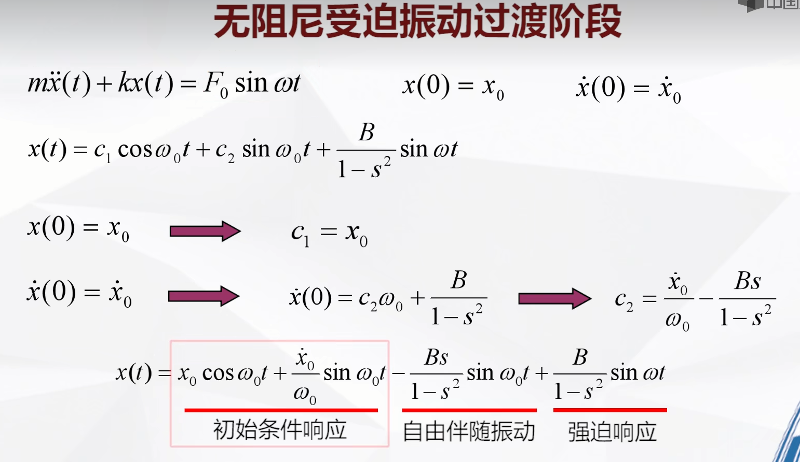
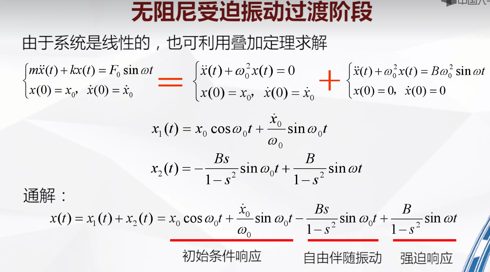

# 无阻尼受迫振动求解过程

# 参考文件
<iframe width="100%" height="468" src="https://www.bilibili.com/video/BV177411h7zV?spm_id_from=333.788.videopod.episodes&vd_source=b74af8d6f481026ee0d55f4ec1db8758&p=21" scrolling="no" border="0" frameborder="no" framespacing="0" allowfullscreen="true"> </iframe>