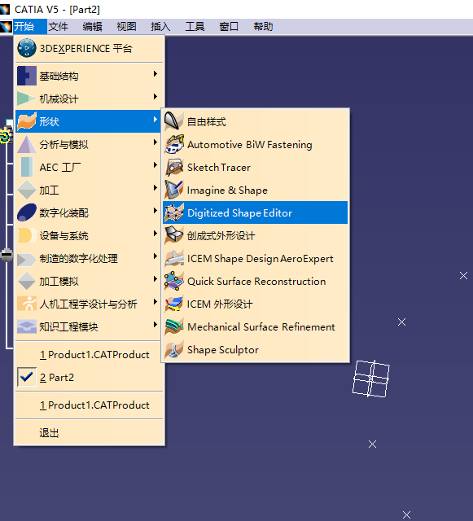
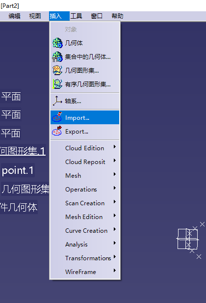
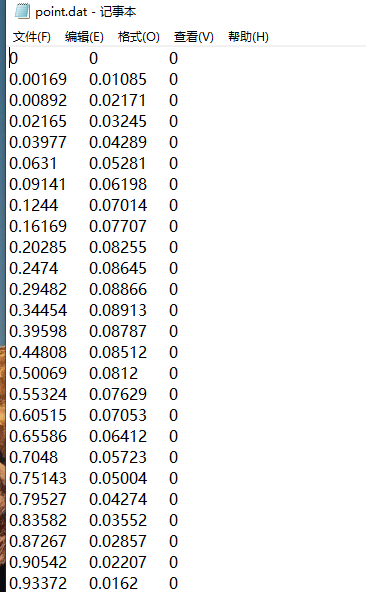
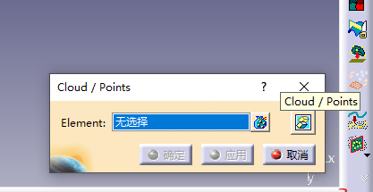

# 等效机翼模型建立
&emsp;&emsp;由翼根向中轴面延申的机翼模型，若有边条翼则沿边条翼向中轴面延伸，若无边条翼则直接从翼根反向延伸至中轴面。  
&emsp;&emsp;通过[翼型网站](http://airfoiltools.com/)得到飞机翼型，通过catia-形状-Digital shape editior 中的import导入.dat文件，文件内容为X Y Z，再通过Cloud point命令将点打散。

