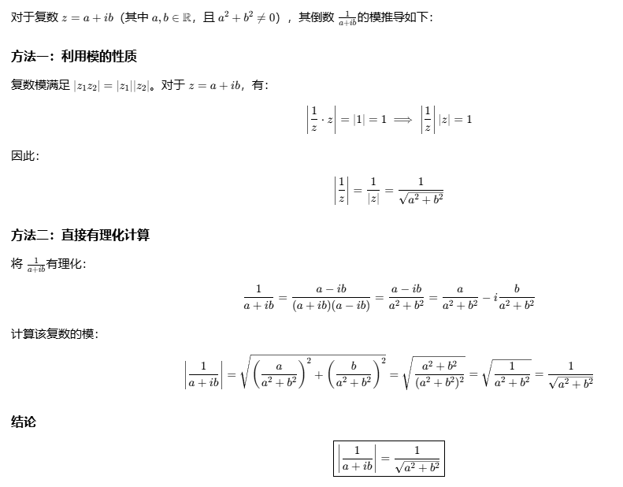
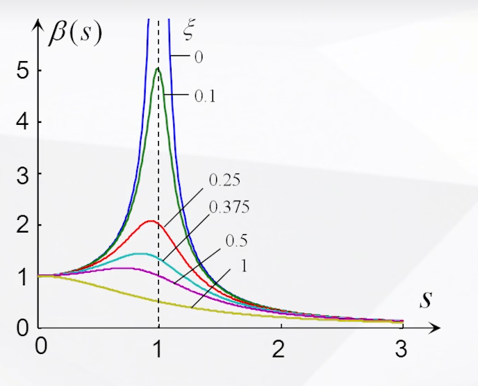
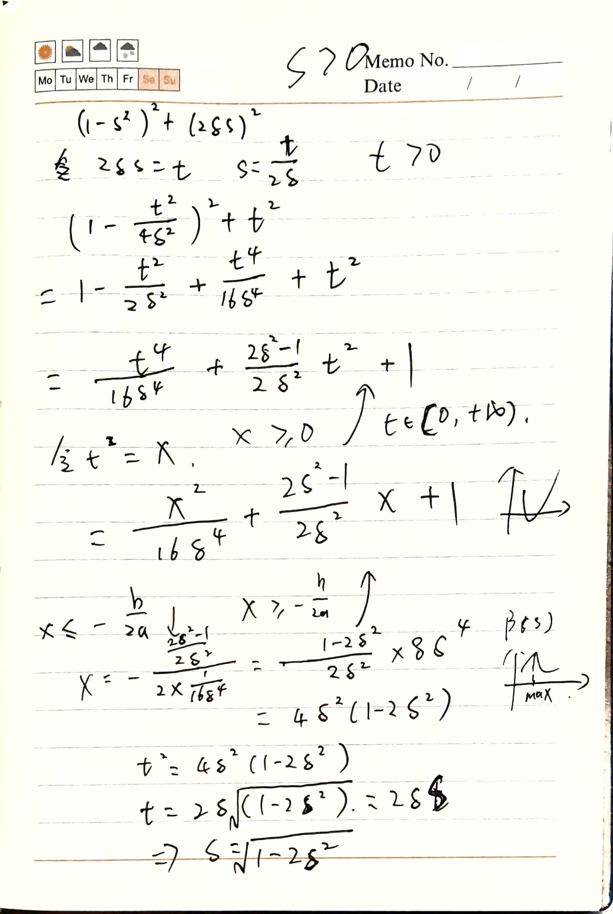

# 受迫振动
## 1.1线性系统的受迫振动
### 1.1.1简谐激励的受迫振动 
&emsp;&emsp;设:$F(t)=F_0e^{i\omega t}$  
&emsp;&emsp;振动微分方程：
$$
m\ddot{x(t)}+c\dot{x(t)}+kx(t)=F_0e^{i\omega t}
$$
&emsp;&emsp;非齐次微分方程的通解=齐次微分方程的通解+非齐次微分方程的特解  
&emsp;&emsp;齐次微分方程的通解就是阻尼自由振动的解，非齐次微分方程的特解为持续振动的稳态响应；
#### 1.1.1.1求解稳态响应
$$
m\ddot{x(t)}+c\dot{x(t)}+kx(t)=F_0e^{i\omega t} 
$$
&emsp;&emsp;m，c，k用$\omega_0$ 、$\zeta$ 、$B=\frac{F_0}{k}$
$$
\ddot{x(t)}+2\zeta\omega_0\dot{x(t)}+\omega_0^2x(t)=B\omega_0e^{i\omega t} 
$$
&emsp;&emsp;设试解：$x(t)=\overline{x}e^{i\omega t}$
&emsp;&emsp;求导$\dot{x}=i\omega\overline{x}e^{i\omega t}$ &emsp; $\ddot{x}=-\omega^2\overline{x}e^{i\omega t}$带入初始微分方程
$$
(-m\omega^2+ic\omega+k)\overline{x}e^{i\omega t}=F_0 e^{i\omega t}
$$
&emsp;&emsp;解：$\overline{x}=\frac{F_0}{-m\omega^2+ic\omega+k}$

&emsp;&emsp;令：$H(\omega)=\frac{1}{-m\omega^2+ic\omega+k}$
&emsp;&emsp;设：$s=\frac{\omega}{\omega_0}$，带入$H(\omega)$
$$
H(s)=\frac{1}{k}\cdot \frac{1}{(1-s^2)+i(2\zeta s)}
$$
&emsp;&emsp;对于虚数求模如下图，因此有$\beta=\frac{1}{\sqrt{(1-s^2)^2+(2\zeta s)^2}}$  

&emsp;&emsp;将$H(s)$用复数表示$H(s)=\frac{1}{k}\beta e^{-i\theta}$，$\theta=tg^{-1}(\frac{2\zeta s}{1-s^2})$
&emsp;&emsp;将$H(\omega)$带入试解得到稳态振动的特解：  
$$
x(t)=\overline{x}e^{i\omega t}=F_0 H(s)e^{i\omega t}=F_0\frac{1}{k}\beta e^{-i\theta}\cdot e^{i\omega t}=F_0\frac{1}{k}\beta e^{i(\omega t-\theta)}
$$
&emsp;&emsp;&emsp;&emsp;&emsp;&emsp;$\beta=\frac{1}{\sqrt{(1-s^2)^2+(2\zeta s)^2}}$
&emsp;&emsp;$\theta=tg^{-1}(\frac{2\zeta s}{1-s^2})$
&emsp;&emsp;$s=\frac{\omega}{\omega_0}$
#### 1.1.1.2系统稳态响应特性
1. 线性系统对谐振激励的稳态响应是频率等同于激振频率、而相位滞后激振力的简写振动；  
2. 稳态响应的振幅及相位只取决于系统本身的物理性质（m，c，k）和激振力的频率及力幅值，而与系统进入运动的方式（即初始条件）无关；

#### 1.1.1.3稳态响应幅频特性
&emsp;&emsp;以s为横坐标画$\beta (s)$曲线
$$
\beta=\frac{1}{\sqrt{(1-s^2)^2+(2\zeta s)^2}}
$$

&emsp;&emsp;讨论：  
&emsp;&emsp;1. 当s<<1时（$\omega<<\omega_0$），$\beta \approx 1$
$$
x(t)=\frac{F_0}{k}\beta e^{i(\omega t-\theta)}=\frac{F_0}{k}e^{i(\omega t-\theta)}
$$
&emsp;&emsp;系统响应与系统静位移相当；

&emsp;&emsp;2. 当s>>1时（$\omega>>\omega_0$），$\beta \approx 0$
$$
x(t)=\frac{F_0}{k}\beta e^{i(\omega t-\theta)}=0
$$
&emsp;&emsp;系统响应振幅很小；

&emsp;&emsp;3. 当s>>1，s<<1区域  
&emsp;&emsp;对于不同的$\zeta$值，$\beta$值接近，阻尼的影响在这两个区间影响不显著，系统可以按无阻尼情况考虑；

&emsp;&emsp;4. 当$s \approx 1$时（$\omega \approx \omega_0$）
$$
x(t)=\frac{F_0}{k}\beta e^{i(\omega t-\theta)}=0
$$
&emsp;&emsp;&emsp;&emsp;对于较小的$\zeta$值，$\beta$迅速增大；  

&emsp;&emsp;5. 当$s = 1$时，$\beta \to \infty$  
&emsp;&emsp;&emsp;&emsp;发生共振，但共振对阻尼的影响很敏感，在s=1附件的区域内，增加阻尼可以使振幅明显下降；  

&emsp;&emsp;6. 对于有阻尼系统，$\beta_{max}$需要讨论函数的单调性
$$
x(t)=\frac{F_0}{k}\beta e^{i(\omega t-\theta)}=0
$$
&emsp;&emsp;当$s = \sqrt{1-2\zeta^2}$，$\beta=\beta_{max}=\frac{1}{2\zeta\sqrt{1-\zeta^2}}$  

&emsp;&emsp;7. 当$\zeta>1/\sqrt{2}$时，$\beta_{max}<1$
&emsp;&emsp;&emsp;&emsp;振幅无极值；  

