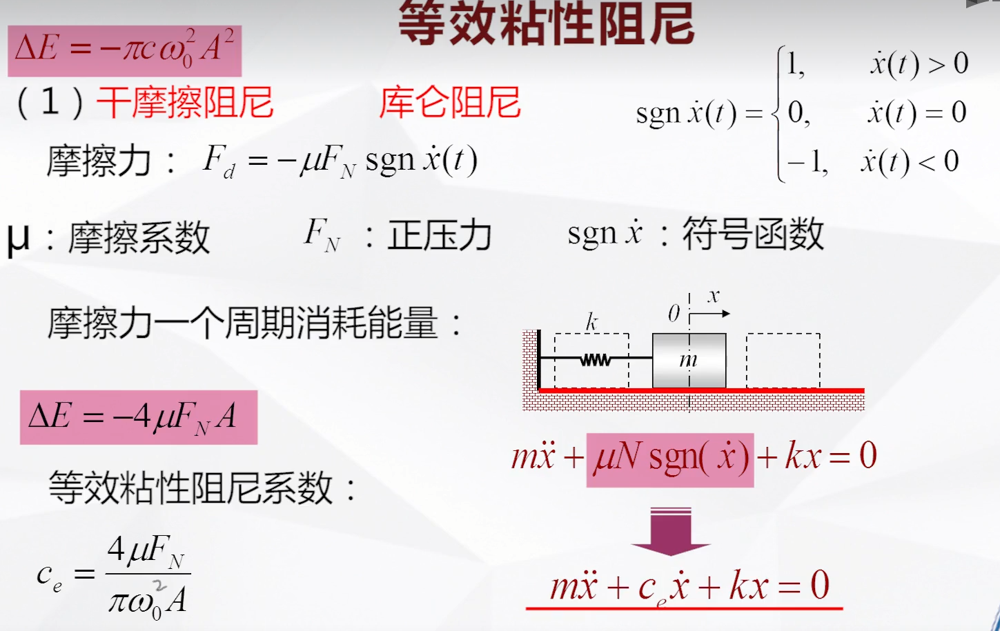
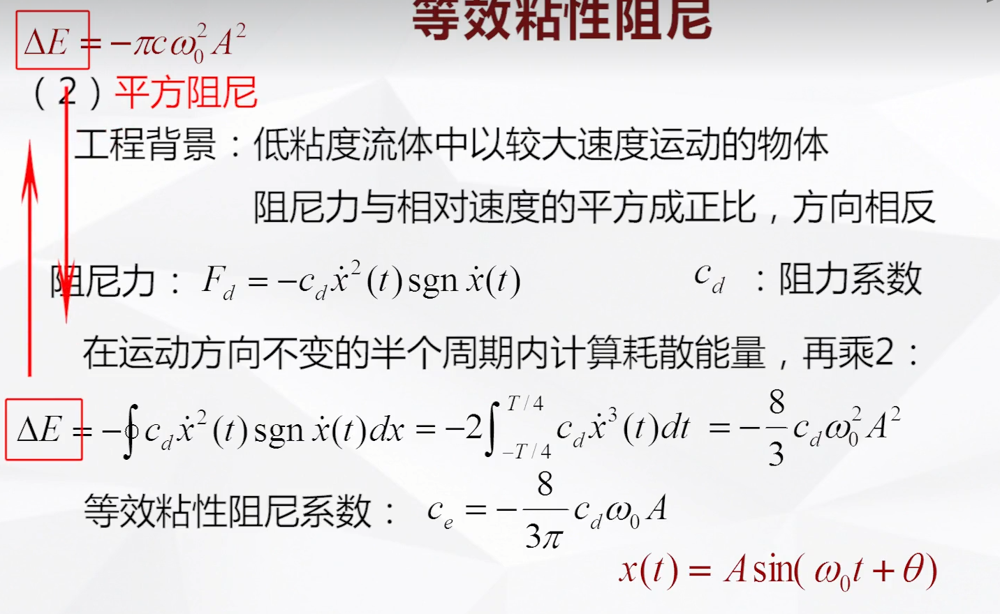
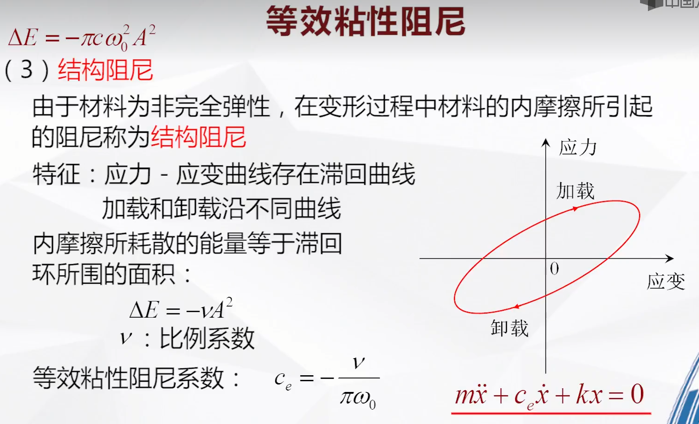

# 等效粘性阻尼
&emsp;&emsp;阻尼在所有的振动系统中都是客观存在，但大多数阻尼都是非粘性阻尼，数学描述不是与$\dot{x}$成正比，但高阶关系难以求解，需要将非粘性阻尼简化为等效的粘性阻尼。  
&emsp;&emsp;等效方法：等效粘性阻尼在一个周期内消耗的能量等于要简化的非粘性阻尼在同一个周期内消耗的能量。
&emsp;&emsp;假设：在简谐激励下非粘性阻尼的稳态响应仍然为简谐振动。（非粘性阻尼较小）  
&emsp;&emsp;粘性阻尼在一个周期内消耗的能量$\Delta E$可以通过力乘以位移得到  
$$
\Delta E=-\oint c \cdot \dot{x} dx=-\int_{0}^{T} c\dot{x}^2 \, dt \\
$$
&emsp;&emsp;$\text{简谐振动响应} x(t)=Asin(\omega_0t+\theta)$带入积分  
$$
\Delta E=-c\omega_0^2A^2\int_{0}^{T} \cos^2(\omega_0t+\theta) \, dt =-\pi c\omega_0^2A^2
$$

## 1）干摩擦
&emsp;&emsp;通过对摩擦力一个周期进行分段积分得到摩擦力一个周期消耗能量，等效粘性阻尼一个周期消耗能量，可以推到得到等效粘性阻尼系数$c_e$
$$
c_e=\frac{4\mu F_N}{\pi \omega_0^2A}
$$

## 2）平方阻尼
&emsp;&emsp;平方阻尼推到得到等效粘性阻尼系数$c_e$
$$
c_e=-\frac{8}{3\pi}c_d\omega_0A
$$
 
## 3）结构阻尼
$$
c_e=-\frac{\nu}{\pi \omega_0}
$$

# 库伦摩擦自由振动
&emsp;&emsp;阻尼项为常数，其解要带一个常数项。

# 参考文件
<iframe width="100%" height="468" src="https://www.bilibili.com/video/BV177411h7zV?spm_id_from=333.788.videopod.episodes&vd_source=b74af8d6f481026ee0d55f4ec1db8758&p=15" scrolling="no" border="0" frameborder="no" framespacing="0" allowfullscreen="true"> </iframe>